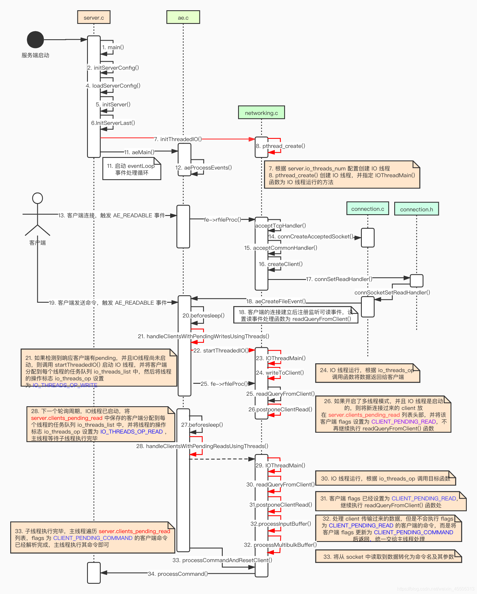

## redis多线程的理解

首先看一下redis的启动流程和接受请求的处理

我们首先要明白的是对于以前版本的redis而言，所有的处理都是在一个线程内处理的
1.首先是redis的eventloop来通过epoll获取请求，然后会遍历所有的请求在同一个线程里进行处理。
2.然后处理完命令就会将结果通过addReplay方法记录到 buf中
3.最后统一处理redis写回客户端的操作。


对于redis6而言

本图来源于https://blog.csdn.net/weixin_45505313/article/details/108562756

这里我们需要说明一下
redis要出发多线程是有条件的：

* 配置项io-threads需要大于 1，否则会继续使用单线程操作读写 I/O
* 配置项io-threads-do-reads控制读 I/O 是否使用线程化
* 对于延迟读取，由postponeClientRead()方法控制。方法中除了配置要求外，还需要当前 client 不能是主从模型的角色，也不能处于已经等待下次事件循环线程化读取（CLIENT_PENDING_READ）的状态。在这个方法中client对象会被添加到等待队列中，并且将 client 的状态改为CLIENT_PENDING_READ。
* 对于多线程写 I/O，由handleClientsWithPendingWritesUsingThreads()中的stopThreadedIOIfNeeded()方法加以限制。除了对应配置项要满足要求外，server.clients_pending_write的长度需要大于等于配置线程数的两倍，例如配置使用 6 线程，当写队列长度小于 12 时会继续使用单线程 I/O 。
I/O 线程在initThreadedIO()被创建前，互斥锁处于加锁状态，因此线程不能进行实际的任务处理。server对象的io_threads_active属性默认会处于关闭状态，在进行首次多线程写之前才会被开启。这意味着服务启动后的读操作仍然会使用单线程读，产生执行结果到写的 pending list 中，在第二次循环中，服务判断是否有配置启用 TIO，将server.io_threads_active属性打开，然后进行多线程写操作，从下一次循环开始 TIO 才能被作用于读操作上。上一点说过写 I/O 会有配置和队列长度判定，在判定不需要 TIO 写时，会重新把server.io_threads_active关闭，意味着尽管你已经在配置文件里面打开 TIO 读，但是 Redis 仍然会根据负载时不时跳过使用它。


首先我们看一下处理的过程
```c
void initThreadedIO(void) {
    server.io_threads_active = 0; /* We start with threads not active. */

    /* Don't spawn any thread if the user selected a single thread:
     * we'll handle I/O directly from the main thread. */

     //如果只有一个线程则继续使用现在的主线程
    if (server.io_threads_num == 1) return;

    if (server.io_threads_num > IO_THREADS_MAX_NUM) {
        serverLog(LL_WARNING,"Fatal: too many I/O threads configured. "
                             "The maximum number is %d.", IO_THREADS_MAX_NUM);
        exit(1);
    }

    /* Spawn and initialize the I/O threads. */
    for (int i = 0; i < server.io_threads_num; i++) {
        /* Things we do for all the threads including the main thread. */
        //位每一个线层创建一个列表
        io_threads_list[i] = listCreate();
        //第一个线程认为是 主线程
        if (i == 0) continue; /* Thread 0 is the main thread. */

        /* Things we do only for the additional threads. */
        pthread_t tid;
        //调用C语言的能力
        //pthread_mutex_init() 函数是以动态方式创建互斥锁的，参数attr指定了新建互斥锁的属性。如果参数attr为空(NULL)，
        // 则使用默认的互斥锁属性，默认属性为快速互斥锁 。互斥锁的属性在创建锁的时候指定，在LinuxThreads实现中仅有一个锁类型属性，
        // 不同的锁类型在试图对一个已经被锁定的互斥锁加锁时表现不同。
        //pthread_mutexattr_init() 函数成功完成之后会返回零，其他任何返回值都表示出现了错误。
        pthread_mutex_init(&io_threads_mutex[i],NULL);
        //设置等待的数量为0
        io_threads_pending[i] = 0;
        //获取锁
        pthread_mutex_lock(&io_threads_mutex[i]); /* Thread will be stopped. */
        //创建线程
        //tid 线程标识符指针
        //第二个参数默认属性
        //第三个参数 处理的函数
        //第四个参数
        if (pthread_create(&tid,NULL,IOThreadMain,(void*)(long)i) != 0) {
            serverLog(LL_WARNING,"Fatal: Can't initialize IO thread.");
            exit(1);
        }
        io_threads[i] = tid;
    }
}
```
初始化的时候，io_threads_active默认为0标识线程并没有激活，这里主要是创建线程已经分配对应的队列。
而且这里会由主线程获取到其他线程标识的锁`io_threads_mutex`

readQueryFromClient方法是接受请求的地方，然后这里会用postponeClientRead方法判断是否加入队列延迟读
```c
int postponeClientRead(client *c) {
    if (server.io_threads_active &&
        server.io_threads_active &&
        !ProcessingEventsWhileBlocked &&
        !(c->flags & (CLIENT_MASTER|CLIENT_SLAVE|CLIENT_PENDING_READ)))
    {
        c->flags |= CLIENT_PENDING_READ;
        listAddNodeHead(server.clients_pending_read,c);
        return 1;
    } else {
        return 0;
    }
}
```

首先要加入队列的第一个条件 就是io_threads_active，然后要求io_threads_active
由于我们前面知道我们在初始化线程方法`initThreadedIO`方法中默认声明的就是不开启

那么问题来了什么情况下会开启呢？
最终通过定位代码找到
```c
int handleClientsWithPendingWritesUsingThreads(void) {
    int processed = listLength(server.clients_pending_write);
    if (processed == 0) return 0; /* Return ASAP if there are no clients. */
    /* 
     * 如果没有开启多线程
     * */
    if (server.io_threads_num == 1 || stopThreadedIOIfNeeded()) {
        return handleClientsWithPendingWrites();
    }
    /* Start threads if needed. */
    //否则激活多线程
    if (!server.io_threads_active) startThreadedIO();
    ......
}
```
我们可以看到如果stopThreadedIOIfNeeded条件不满足的时候，才会走到下面来
```c
int stopThreadedIOIfNeeded(void) {
    int pending = listLength(server.clients_pending_write);

    /* Return ASAP if IO threads are disabled (single threaded mode). */
    if (server.io_threads_num == 1) return 1;

    //如果小于设置线程数量的2倍，则停止
    if (pending < (server.io_threads_num*2)) {
        if (server.io_threads_active) stopThreadedIO();
        return 1;
    } else {
        return 0;
    }
}
```
这里就要求clients_pending_write的值大于2倍的线程数，clients_pending_write的值是在我们处理完客户端请求后才会增加的。
也就是说要我们的事件循环拿到2倍线程数的请求时候，才会开启读多线程