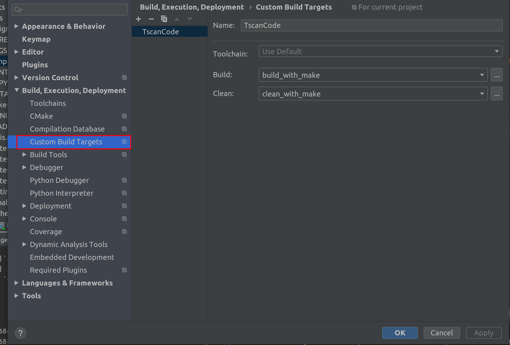
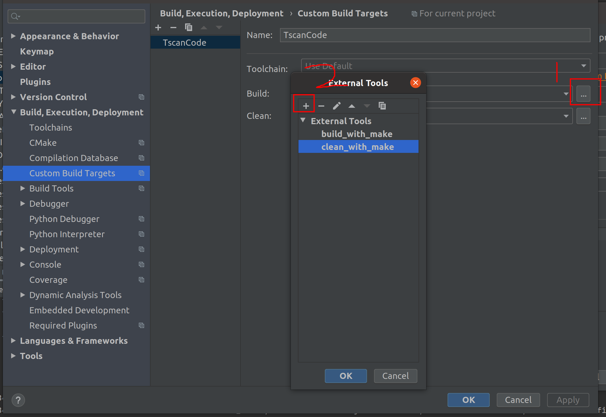
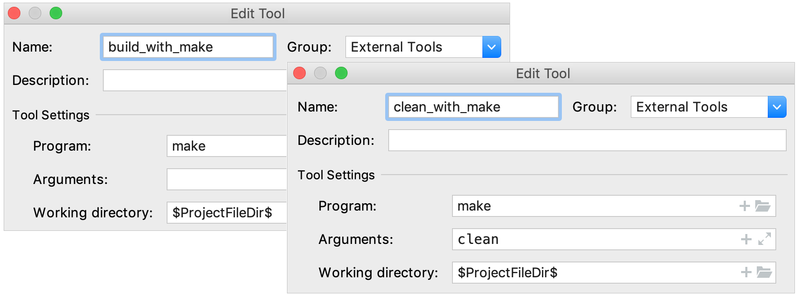
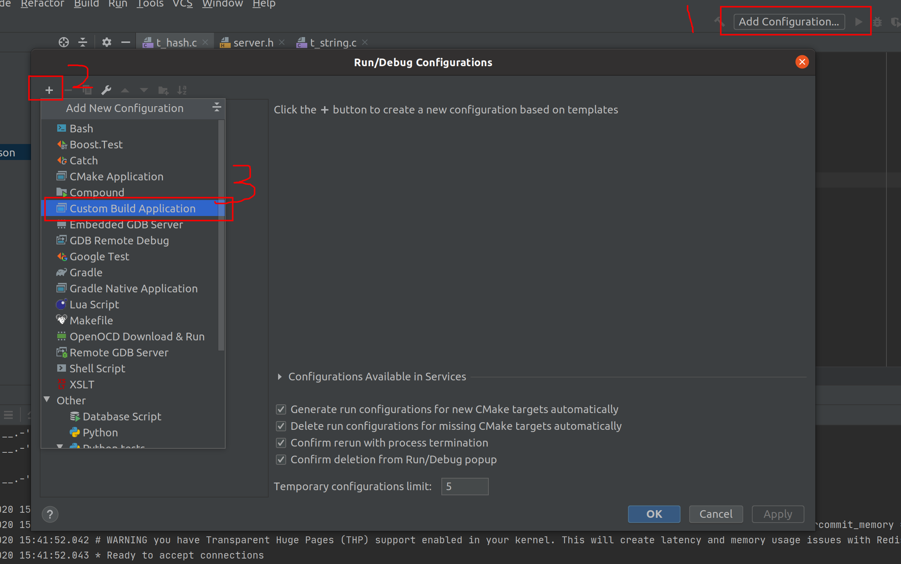
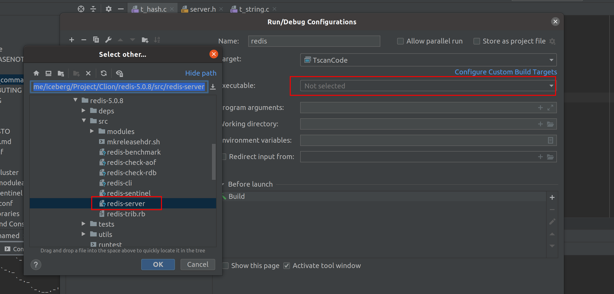
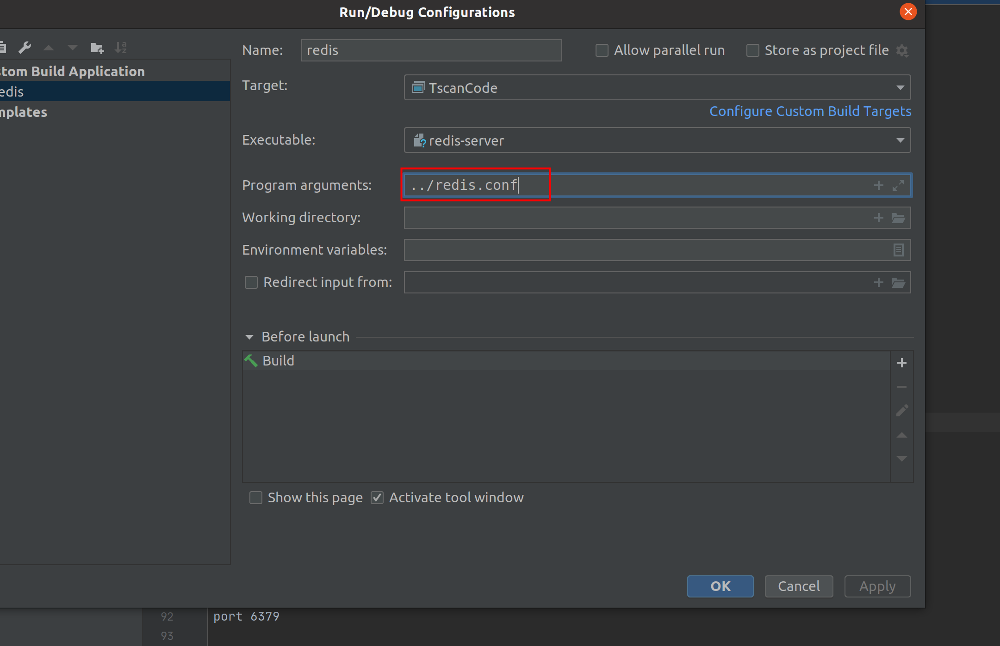
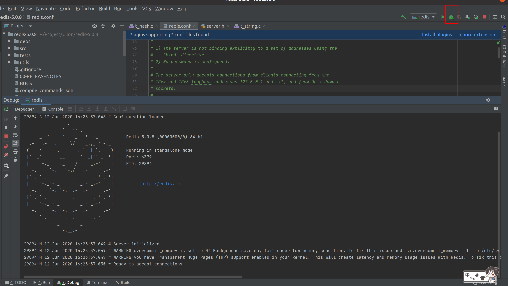
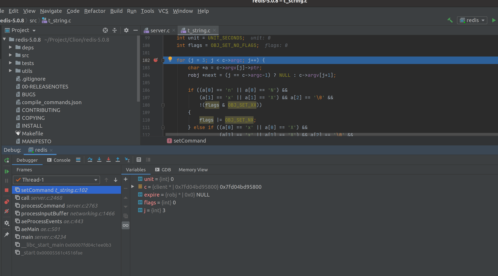
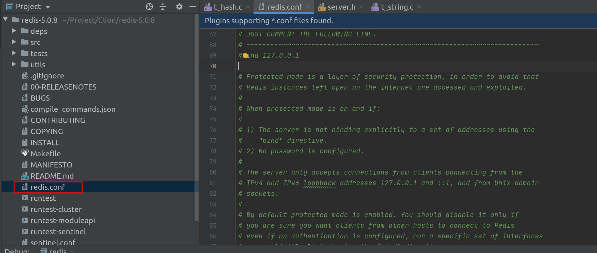
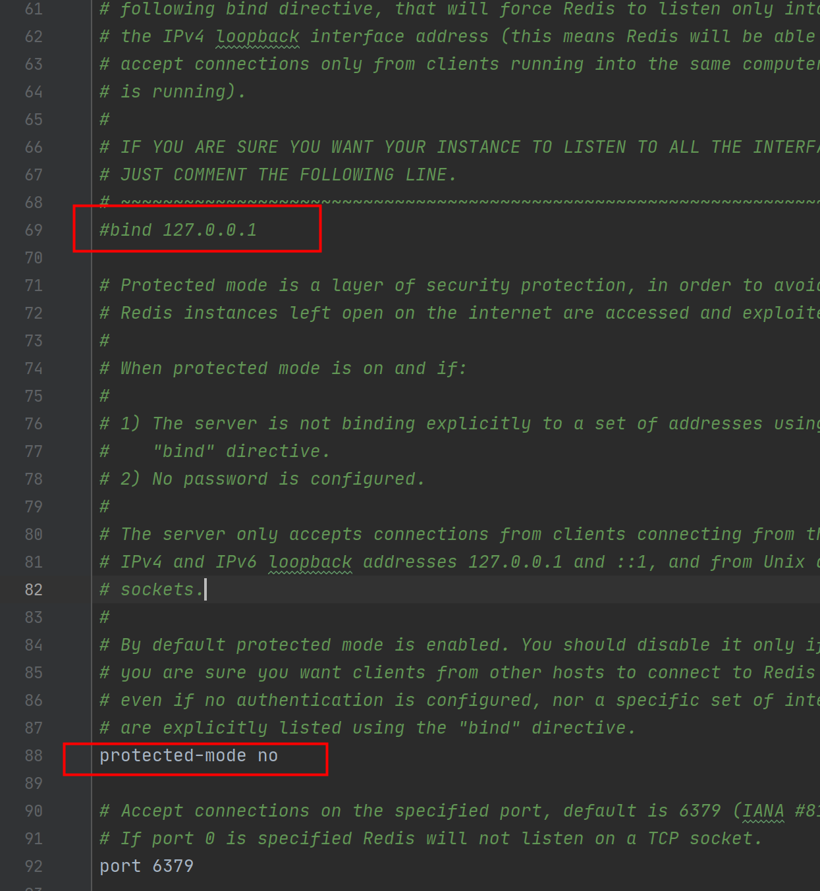

> copy  from  https://www.yht7.com/news/94523


# Clion导入Redis 5.0.8源码（支持代码跳转、断点调试）

## 一、背景介绍

如果你是一名Java开发者，那你一定知道IDEA的大名，这是Jetbrains推出的王牌产品，而Clion则是由Jetbrains推出的C/C++ IDE。

本人因为工作原因需要调试下Redis的代码，但是Redis使用的编译工具是Makefile，而Clion原生只支持CMake，如果你直接导入的话基本就跟使用文本编辑器打开是差不多的，代码跳转就别想了，断点调试更是不可能。

在网上找到的教程都是自己写一个CMakelist，但我不知道咋回事儿都有一些问题，而且每个教程都是各种复制粘贴，令人吐血.....

最后终于被我发现Clion是提供了[方案](https://www.jetbrains.com/help/clion/managing-makefile-projects.html)的，本文就是基于官方的方案，进行的总结。

```
本文环境：Ubuntu 20.04、Clion 2020.1.2
```

## 二、完整步骤

```
首先要准备好Redis 5.0.8的源码并解压，这里就不啰嗦了
```

### 2.1.1 安装pip

通过以下命令安装

```bash
sudo apt update
sudo apt install python3-pip
```

当安装结束，验证安装过程，检查 pip 版本：

```text
pip3 --version
```

出现下列类型的信息则安装成功

```bash
pip 20.0.2 from /usr/lib/python3/dist-packages/pip (python 3.8)
```

### 2.1.2 安装Compilation Database Generator

```bash
pip3 install compiledb
```

### 2.1.3 创建编译数据库

进入redis的根目录，执行以下命令

```bash
compiledb make
```

会生成compile_commands.json文件

### 2.1.4 Clion安装Makefile Support插件

直接在plugins市场里搜索即可

### 2.1.5 将redis导入clion

直接open就行了

### 2.1.6 配置编译工具链

进入settings-Custom Build Targets



点击右侧的省略号按钮，在弹出的窗口点击+号新增工具



两种工具的配置如下所示，Working directory的值时$ProjectFileDir$



### 2.1.7 断点调试配置

点击右上角，创建一个应用



运行的文件选择src下的redis-server



指定redis配置为../redis.conf



点击右上角的debug按钮，开始调试





### 2.1.8 允许远程客户端连接

默认情况下，redis只允许本地的客户端连接。

这里可以根据你的需求自行选择，不改也可以的。

打开redis.conf



将第69行bind 127.0.0.1注释掉，第88行改成protected-mode no



------

- 若本号内容有做得不到位的地方（比如：涉及版权或其他问题），请及时联系我们进行整改即可，会在第一时间进行处理。
